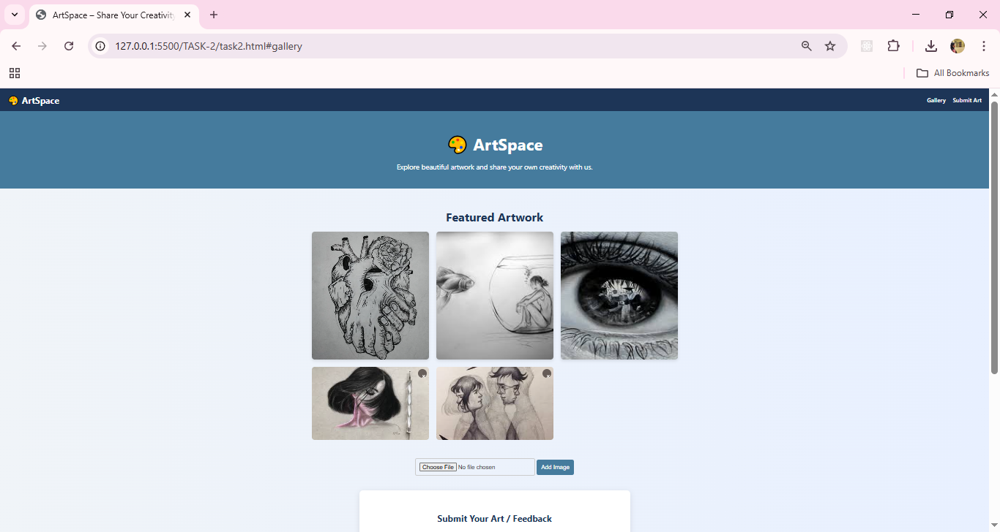
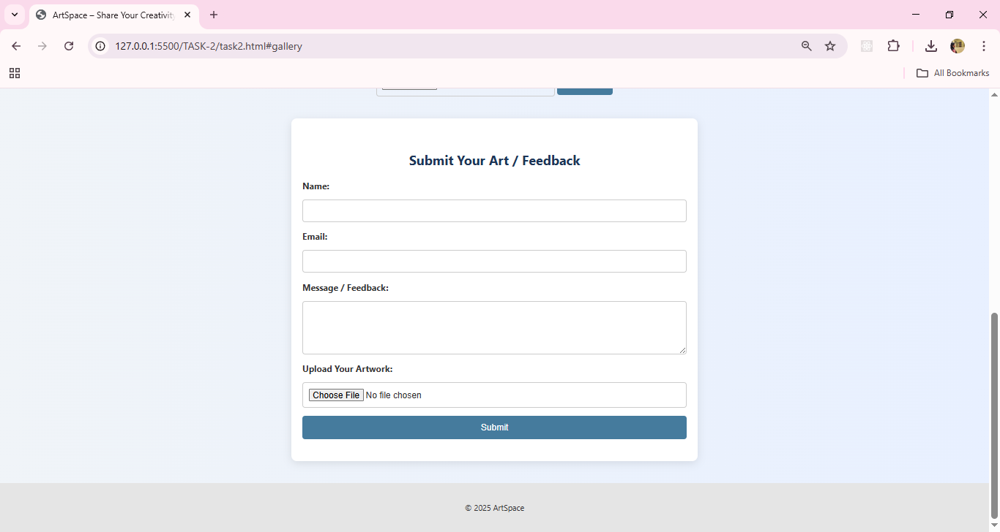

# 🎨 ArtSpace – Share Your Creativity

ArtSpace is a responsive and interactive web application that allows users to explore beautiful artwork, submit their own creations, and dynamically manage an image gallery. This project was built as part of the ApexPlanet Internship – Task 2.

## 🌟 Features

- **Responsive Design** using Flexbox, CSS Grid, and media queries.
- **Interactive Image Gallery** where users can add and remove images dynamically.
- **Styled Contact Form** with modern UI components and visual polish.
- **JavaScript Form Validation** to ensure required fields and email format are correct.
- Clean, minimalist user interface with focus on user experience.

---

## 🛠️ Technologies Used

- **HTML5** – Page structure and semantic layout.
- **CSS3** – Styling, Flexbox, Grid, and responsive design.
- **JavaScript (ES6)** – Form validation and DOM manipulation for gallery interactivity.

---

---

## 🚀 Setup Instructions

1. **Clone the Repository** or download the ZIP.
2. Open the `index.html` file directly in your browser.
3. To test:
   - Submit the form with/without valid input.
   - Add or remove images in the gallery using the upload input.
4. No server setup required—runs entirely on the client-side.

---

## ✍️ Author

Intern at ApexPlanet

---

## 📄 License

This project is for educational and internship purposes under ApexPlanet. You are free to use and modify it with attribution.

---

---

